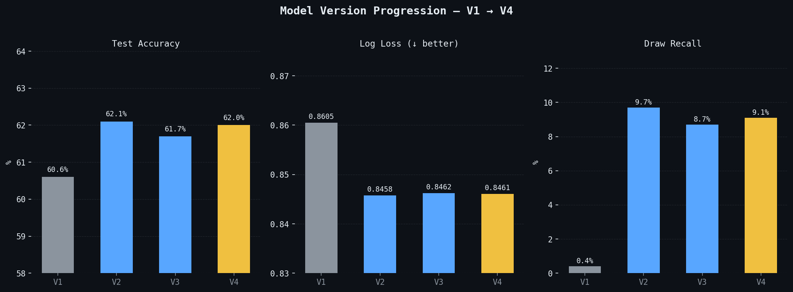
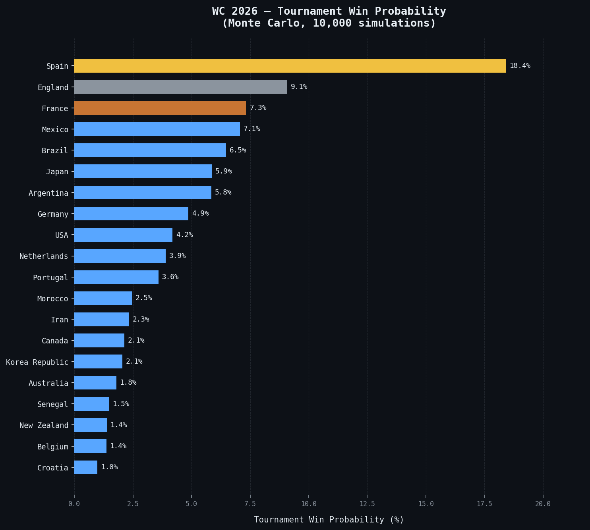
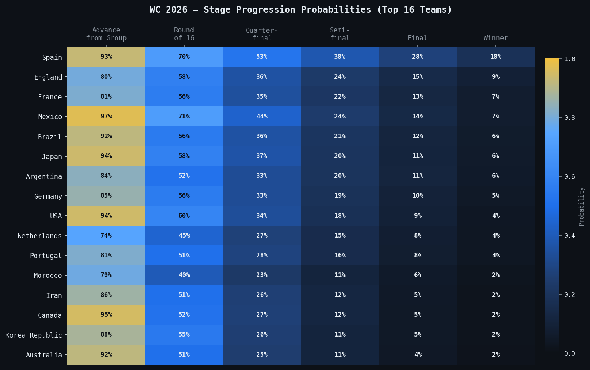
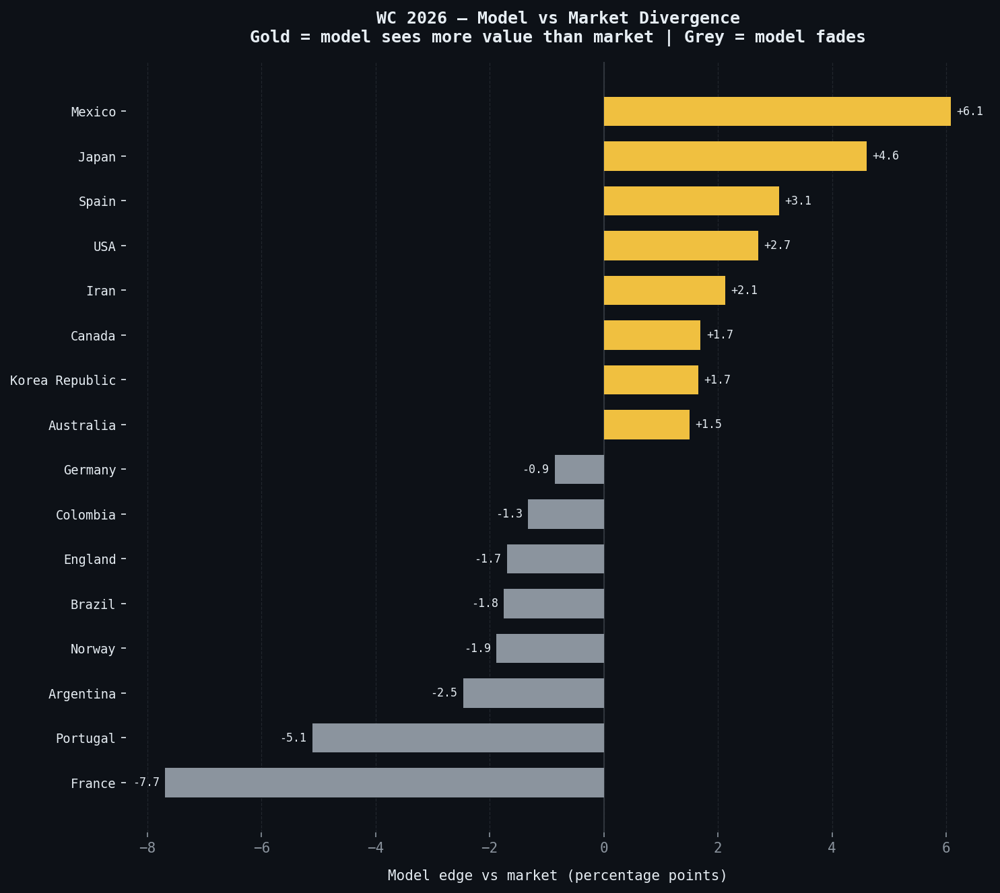
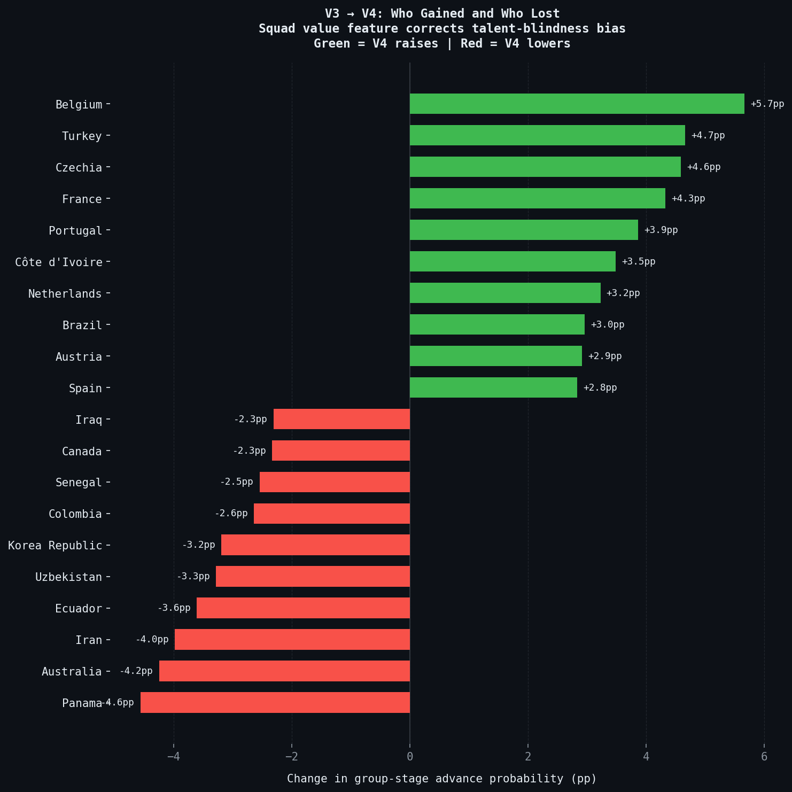
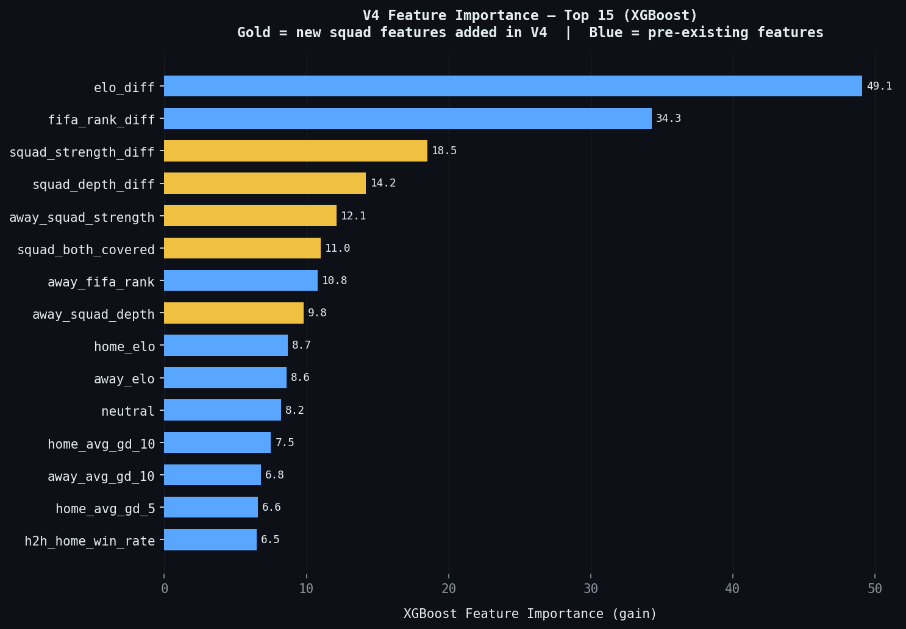
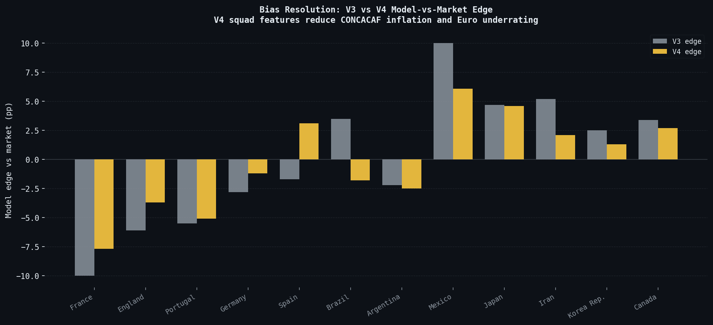
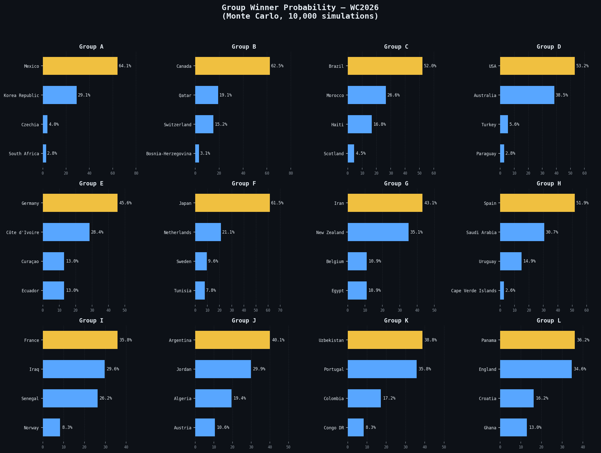
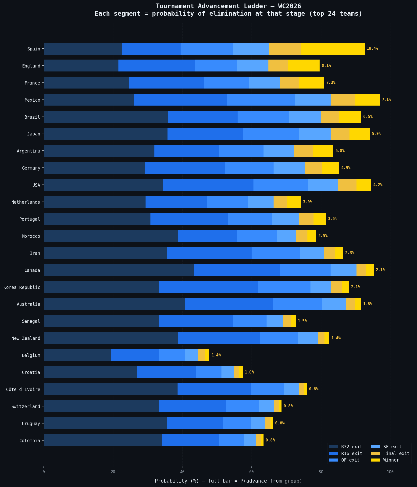

# World Cup 2026 Prediction Model

A machine learning model that predicts match outcomes and simulates the full WC2026 bracket using an ensemble of XGBoost, LightGBM, and Dixon-Coles — with ELO ratings, opponent-quality-weighted form, squad strength from FIFA/EA ratings, and betting-market comparison.

**→ [Live Bracket Simulator](https://andsoitrises.github.io/World-Cup-2026-/outputs/bracket_simulator.html)** — group stage + full knockout simulation, regenerate on demand.

---

## Model Performance (V5 Final)

| Version | Accuracy | Log Loss | Draw Recall | Key Addition |
|---|---|---|---|---|
| V1 — Baseline | 60.6% | 0.8605 | 0.4% | Pipeline, XGB/LGBM, ELO, Monte Carlo |
| V2 — Intelligent | 62.1% | 0.8458 | 9.7% | ELO, opponent-weighted form, Dixon-Coles |
| V3 — Ceiling | 61.7% | 0.8462 | 8.7% | Data fixes, residual analysis, ceiling confirmed |
| V4 — Final | 62.0% | 0.8461 | 9.1% | Squad strength + depth (FIFA/EA ratings) |
| **V5 — 495-Combo Fix ✓** | **62.0%** | **0.8461** | **9.1%** | **3rd-place slot assignment corrected (official FIFA table)** |

**WC2022 backtest log loss: 1.0447** (24.3% better than naive baseline)
**Model↔market correlation: 0.838** (up from 0.665 in V3)

---

## WC2026 Live Forecast

| Team | FIFA Rank | Group Advance % | Win % |
|---|---|---|---|
| Spain | 2 | 92.6% | 18.4% |
| England | 4 | 79.6% | 9.1% |
| France | 1 | 81.0% | 7.3% |
| Mexico | 15 | 97.0% | 7.1% |
| Brazil | 6 | 91.6% | 6.5% |
| Japan | 18 | 94.1% | 5.9% |
| Argentina | 3 | 83.6% | 5.8% |
| Germany | 10 | 85.2% | 4.9% |
| USA | 16 | 94.5% | 4.2% |
| Netherlands | 7 | 74.2% | 3.9% |

*From `data/processed/tournament_probs_live.csv` — updated by `src/models/live_update.py` after each matchday.*

---

## Visualizations

### Model Progression V1→V4


### Tournament Win Probabilities (V4 Live)


### Stage Progression Heatmap — Top 16 Teams


### Model vs Market Divergence (V4)


### V3 → V4 Bracket Shift (Squad Features Added)


### Feature Importance (V4 — Squad Features Highlighted)


### Bias Resolution: V3 vs V4


### Group Winner Probability — All 12 Groups


### Tournament Advancement Ladder — Top 24 Teams


---

## Key Findings

**ELO is the dominant signal.** `elo_diff` ranks #1 in XGBoost feature importance by a wide margin. Squad strength diff landed #3 after V4.

**Squad quality was the proven missing signal.** V4 diagnostic: squad market value carries +0.178 incremental R² beyond existing features. Sourced via FIFA/EA video-game ratings (2005→FC26), leakage-safe via backward asof merge.

**CONCACAF inflation — real and partially fixed.** V3: Mexico overrated by +10pp vs market. V4 reduced to +6.1pp. France bias reduced from −9pp to −7.7pp. Model↔market correlation: 0.665 → 0.838.

**Draw recall is structurally capped at ~9%.** Across all versions. Draws are fundamentally hard to predict with available features.

**V5 confirmed the ceiling.** All remaining levers tested under validate-or-cut: confederation strength (redundant), squad coverage extension (data-blocked), ensemble reweight (overfit), historical odds backtest (data-gated). V4 is the final validated model.

---

## How It Works

### Feature Engineering (48 features)
- ELO ratings (home/away/diff) — tiered K-factors 40/30/20 by tournament type
- FIFA rank differential
- Rolling win rate, avg goals, avg GD (last 5 and 10 games) — raw + opponent-ELO-weighted
- Head-to-head record (cumulative, no leakage)
- Days rest, altitude, tournament tier, neutral venue flag, is_knockout
- **Squad strength + depth** (home/away/diff, coverage flag) — from FIFA/EA ratings 2005→FC26

All rolling features use `shift(1)` — no data leakage. Temporal train/test split only (no random CV shuffle).

### Models
- **XGBoost / LightGBM** — multiclass (away/draw/home), depth-3, draw-upweighted 1.75×
- **Dixon-Coles** — Poisson goal model with rho correction for low-scoring draws
- **Ensemble** — fixed weights XGB 27.5% / LGBM 27.5% / DC 45% (validated near-optimal vs stacked meta-learner)

### Monte Carlo Simulator
10,000 bracket simulations: Poisson score sampling for group-stage tiebreakers, top 2 per group + best 8 third-place teams advance, ensemble probabilities for knockout rounds.

### Live Update Pipeline
`src/models/live_update.py` — after each matchday: ingests `data/raw/wc2026_live_results.csv`, updates ELO with actual results (K=40, neutral), locks known group scores and knockout winners in simulation, re-runs 10k sims, outputs `tournament_probs_live.csv`.

---

## Project Structure

```
data/
  raw/                  # results, rankings, fixtures, live results
  processed/            # features, ELO, predictions, tournament probs
models/                 # trained model artifacts (v1–v4 + prod)
outputs/
  key_insights/         # 7 visualization charts
  bracket_simulator.html  # interactive bracket (open in browser)
src/
  features/             # data_cleaning, elo, feature_engineering, build_squad_strength
  models/               # all model scripts + quant learning stack
    calibration.py      # reliability diagrams, Brier score, Platt/isotonic recal
    backtest.py         # walk-forward expanding-window validation
    market_backtest.py  # IC harness vs market
    signal_test.py      # orthogonality gate for new features
    live_update.py      # live tournament pipeline
  visualization/        # charts.py
KEY_INSIGHTS.md         # executive summary — all findings + learning path status
CONTEXT_V4.md           # operational session notes
CONTEXT_V5.md           # V5 ceiling confirmation
CONTEXT_QUANT_TRANSITION.md  # full intellectual history V1→V4
```

---

## How to Run

```bash
# Windows — set UTF-8 first
set PYTHONUTF8=1

# Environment
python -m venv venv && venv\Scripts\activate
pip install -r requirements.txt

# Pipeline
python -m src.features.data_cleaning
python -m src.features.elo
python -m src.features.build_squad_strength
python -m src.features.feature_engineering

# Train
python -m src.models.dixon_coles
python -m src.models.train_xgb
python -m src.models.train_lgbm

# Predict + simulate
python -m src.models.predict_wc2026
python -m src.models.monte_carlo

# Live update (after each matchday)
python -m src.models.live_update

# Analysis
python -m src.models.market_divergence
python -m src.visualization.charts
```

---

## Quant Learning Stack (built alongside the model)

| Step | Concept | Script | Status |
|---|---|---|---|
| 1 | Calibration & proper scoring | `src/models/calibration.py` | ✅ |
| 2 | Market as benchmark / IC | `src/models/market_backtest.py` | ✅ |
| 3 | Walk-forward backtesting | `src/models/backtest.py` | ✅ |
| 4 | EV & Kelly criterion | `src/models/bet_sim.py` | ⬜ |
| 5 | Bayesian / hierarchical model | — | ⬜ |
| 6 | Signal orthogonality | `src/models/signal_test.py` | ✅ |
| 7 | Aleatoric vs epistemic uncertainty | — | ⬜ |

---

## Live Update Instructions

After each matchday, add actual results to `data/raw/wc2026_live_results.csv`:

```
match_id,stage,group,date,home_team,away_team,home_goals,away_goals,decided_by,winner
1,Group Stage,A,2026-06-11,Mexico,TeamX,2,0,FT,Mexico
```

Then run:

```bash
python -m src.models.live_update
```

Output: `data/processed/tournament_probs_live.csv` — fresh probabilities with actual results locked. Copy the updated values into `outputs/bracket_simulator.html` (`TEAMS` / `GROUPS`) and push to GitHub Pages.

---

## Tech Stack

Python 3.10+ · pandas · numpy · scikit-learn · XGBoost · LightGBM · scipy · matplotlib
